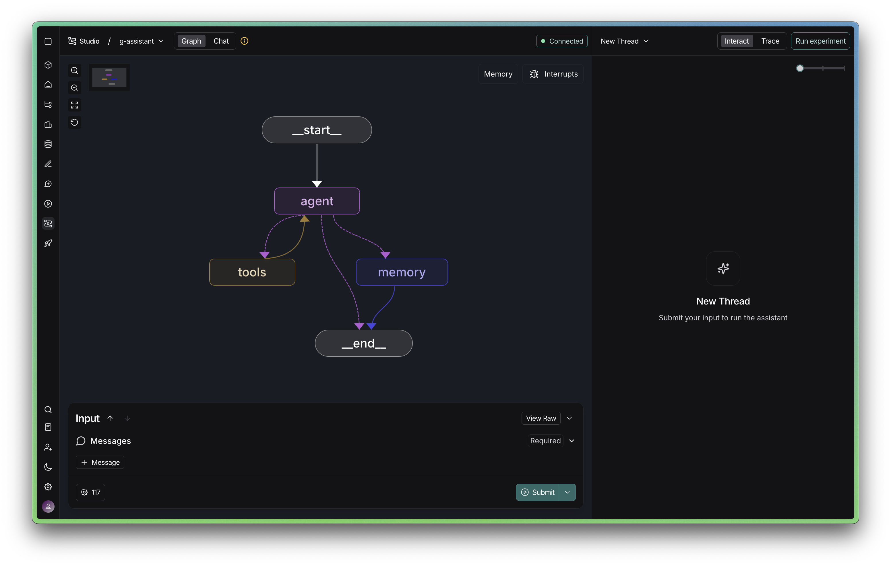
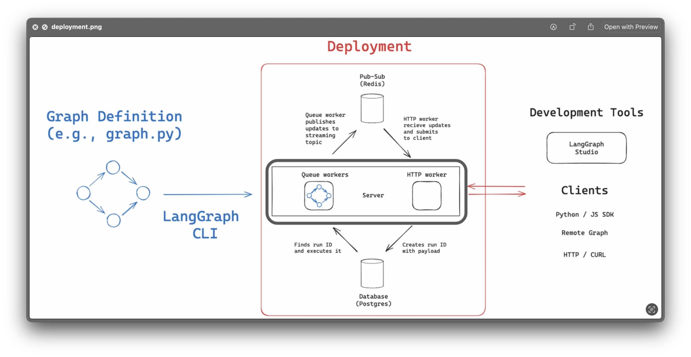

# G-Assistant
An intelligent calendar management agent built with LangGraph that uses memory persistence and Google Calendar integration.

## Graph Architecture



## Key Concepts

- **ReAct Agents**: Reasoning and acting pattern for intelligent decision-making
- **Tool Calling**: Integration with Google Calendar API (get/create events)
- **TrustCall Extractors**: Structured information extraction for user profile management
- **Memory Persistence**: User profile storage using LangGraph Store
- **Parallel Execution**: Concurrent tool execution and memory updates
- **LangGraph Deployment**: Production-ready deployment with PostgreSQL and Redis

## Deployment Architecture


[image from langchain-academy]

## Quick Start

### Build Image
```bash
langgraph build -t g-assistant-image
```

### Deploy
```bash
docker compose up -d
```

### Access
- API: `http://localhost:8123`
- PostgreSQL: `localhost:5432`
- Redis: `localhost:6379`

## Environment Variables

Required in `.env`:
- `OPENAI_API_KEY`
- `GOOGLE_APPLICATION_CREDENTIALS`
